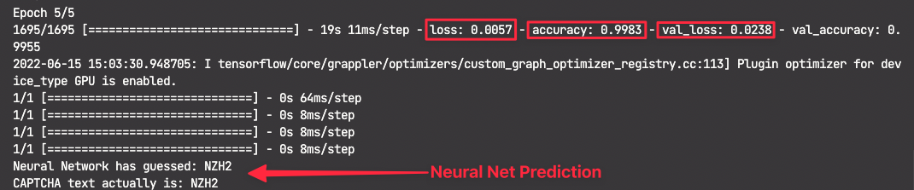

# Progress (features)
###### Current (June 2022)
- testing against really simple CAPTCHA (rsCAPTCHA) for proof of concept
- implement bot to scrape the web for more CAPTCHA's so there is a larger data pool to train against
- implement the CAPTCHA image/text preprocessing script

###### Current Metrics

- 0.5% loss
- 99.7% accurate

## Setting up Anaconda for project
- install anaconda -> https://www.anaconda.com/products/distribution
- create a virtual env for the project to run in: 
	- ```conda create -n {newEnvironmentName} python=3.9.5```
- activate the virtual environment (venv):
	- ```conda activate {newEnvironmentName}```
- cd to the ```src``` folder and then install project dependencies from requirements file:
	- ```pip install -r requirements.txt ```
# How This Works...

### Pre-Processing for Neural-Network
- [] ***Step 1
	- Collect a large amount of CAPTCHA's of desired type
		- (rsCAPTCHA for current training model)
	- [ ] Potentially implement a web bot/scraper to pull down CAPTCHA's
- [] ***Step 2
	- specify the folder where all CAPTCHA images are stored and then enumerate them all 
- [] ***Step 3***
	- threshold CAPTCHA images 
	- grayscale CAPTCHA images
	> this step is only necessary so it reduces computation- with this more images can be used in the training set which only further increases the accuracy of the model since a gradient descent loss reduction approach is used
- [] ***Step 4
	- obtain the label / text of the CAPTCHA with the cv processing technique
- [] **Step 5
	- take the contours of the CAPTCHA and then use that to find the bounding rectangles around each character
- [] ***Step 6
	- crop the characters and save them to an output folder
### Defining the Neural Network

### Training the Neural Network

### Neural Network Solving CAPTCHA's


## Execution Instructions
###### Preprocessing
- run the 'image-preprocessing.py' script in the src folder 
- confirm a new (if it wasn't already there) directory called 'extracted-letter-images' was made and is populated with images that appear to contain images of individual characters
	- this should be sorted in sub folders of numbers and letters corresponding to the character extracted from the CAPTCHA
###### Neural Network Training

